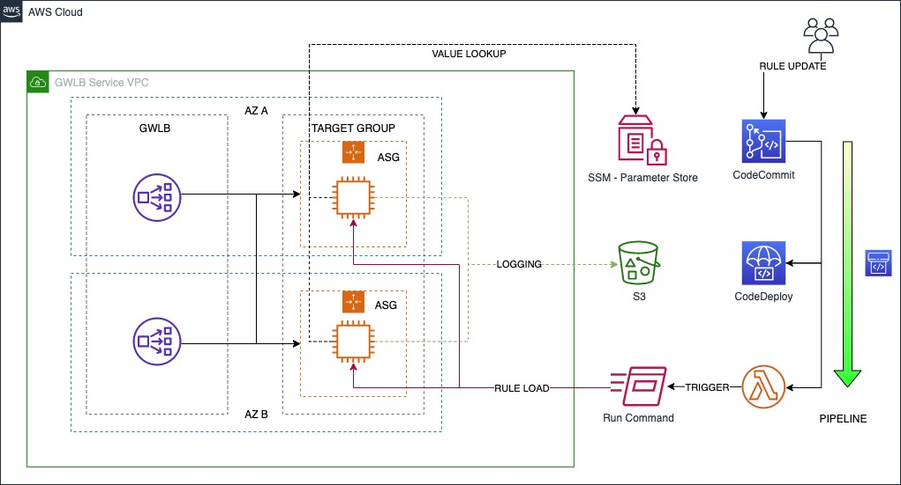

# Building and open-source IPS/IDS Service on Gateway Load Balancer

## How to deploy

### 

1. run cloudformation/cloudformation.yml to setup the Suricata cluster on ECS. The default Dockerimage for suricata to use are built using the environment under Dockerfiles/suricata. If you want to make some modifications to this environment, please see next topics. 
The cloudformation builds an appliance VPC similar to this: https://github.com/aws-samples/aws-gateway-load-balancer-code-samples/tree/main/aws-cloudformation/distributed_architecture 
### If you want to build your own Dockerfile
1. Clone repo
2. Build and upload dockerfile to a docker repo, eg ECR:
    1. `cd Dockerfiles/suricata/`
    2. `aws ecr get-login-password --region <region> | docker login --username AWS --password-stdin <AccountId>.dkr.ecr.<region>.amazonaws.com`
    3. `docker build -t suricata .`
    4. `docker tag suricata:latest <AccountId>.dkr.ecr.<region>.amazonaws.com/suricata:6.0.1-1`
    5. `docker push <AccountId>.dkr.ecr.<region>.amazonaws.com/suricata:6.0.1-1`
3. run cloudformation/cloudformation.yml to setup the Suricata cluster on ECS. The cloudformation builds an appliance VPC similar to this: https://github.com/aws-samples/aws-gateway-load-balancer-code-samples/tree/main/aws-cloudformation/distributed_architecture

For quick testing: Run https://github.com/aws-samples/aws-gateway-load-balancer-code-samples/blob/main/aws-cloudformation/distributed_architecture/DistributedArchitectureSpokeVpc2Az.yaml and put the Cloudformation output of `ApplianceVpcEndpointServiceName` from the appliance cloudforamtion stack as the input to the `ServiceName` parameter.

### Commmon questions:
**How can I add my own rules?**
In the current setup, you need to build your rules into the docker image. Add your rules to: Dockerfiles/suricata/configs/var/lib/rules/my.rules and rebuild, upload and deploy your new docker image. The thought here is to keep your rules versionized together with the suricata config and suricata version.

**How can I do changes to the suricata config?**
In the current setup, you need to do changes in the suricata.yaml in Dockerfiles/suricata/configs/etc/suricata/suricata.yaml and rebuild, upload and deploy your new docker image. The thought here is to keep your config versionized together with the your rules and suricata version.

The cloudforamtion is able to set some config parameters. These config parameters are ingested into the container as Environment variables so you can easily enable/disable common configuration such as logging and adding managed suricata rules from https://www.openinfosecfoundation.org/rules/index.yaml. The Environment variables are set in the ECS task config, and you don't need to upload a new image to changes these. You just need to update the cloudforamtion template with the new values and ECS will redeploy new suricata containers in a rolling fashion. Sessions will need to be re-established since though.

### Roadmap / TODO / Ideas:

* Support adding suricata rules in parameter store and update them on-the-fly without having to rebuild the container image. In a similar way we add and update the managed suricata rules from https://www.openinfosecfoundation.org/rules/index.yaml
* Create a template which dont deploy a full VPC, so customers can create the Suricata ECS cluster in an existing architecture.
* Move Logrotation, CloudWatch agent to sidecar containers from EC2 configuration
* Graviton / ARM support
* Clean the CFN template(s), eg adding tags, Metadata, see over naming conventions.
* An official Public docker image and repo to enable the one-click deployment to leverage a dockerimgae hosted in an amazon repository instead of my own personal docker repo (Bizzelicious/suricata)
* Test Centralized (TGW) model
* Enable "Deployment circuit breaker" so ECS can automatically rollback bad deployments.
* Create sample CFN templates that creates some example CW alerts, dashboards etc that uses the ingested logs.
