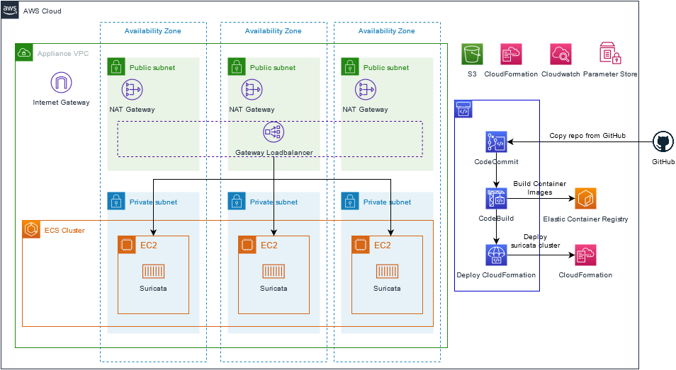

# Building and open-source IPS/IDS Service on Gateway Load Balancer
This repository has deployment, installation and clean up instructions on how to deploy and manage Suricata in AWS with Elastic Container Services and Gateway Loadbalancer. The main use-case for this repo is to provide a baseline from which you can build on. The solution will deploy Suricata on ECS and provides an opportunity to adjust the Suricata configuration and rulesets using a GitOps workflow.


## How to deploy

### Quickstart
The quickest way to deploy Suricata and the CI/CD pipeline needed to support a GitOps workflow is to run a quickstart Cloudformation template. The Quickstart template will setup a AWS Codepipeline using AWS CodeCommit, AWS CodeBuild and CloudFormation and various support resources such as SSM Parameters.
The Quickstart template will copy this GitHub Repo into AWS CodeCommit which will be the Git repo you work against. 

We provide two different QuickStarts:

1. /deployment/base-create-vpc.yaml is creating a complete new environment with a VPC where Suricata will be deployed.
2. /deployment/base-existing-vpc.yaml is using an already existing VPC where Suricata will be deployed. The existing VPC will need to have three private subnets with a default route to a Nat Gateway. The Nat Gateway will of course need to be within a subnet that has the ability to reach the internet via an Internet Gateway.


##### In the following scenario we will use /deployment/base-create-vpc.yaml.

1. Create a Cloudformation stack using the Cloudformation template /deployment/base-create-vpc.yaml in your account.
2. After the stack is created, go to AWS CodeCommit where you will see a repository which looks identical to this repository. Nothing has been built yet, so if you want you can now make changes to the Suricata config, Rulesets, Cloudformation Parameters etc.
3. Go to CodePipeline and select "Enable transition". The pipeline will now start to build a docker image and after that deploy your suricata cluster using Cloudformation.
4. For quick testing: Create a Cloudformation stack using https://github.com/aws-samples/aws-gateway-load-balancer-code-samples/blob/main/aws-cloudformation/distributed_architecture/DistributedArchitectureSpokeVpc2Az.yaml and use the Cloudformation output of `ApplianceVpcEndpointServiceName` from the suricata cluster cloudforamtion stack as the input to the `ServiceName` parameter.


##### Ruleset Management

This solution provides three levels of Ruleset management. 

1. The first is via the 'cluster-template-configuration.json' file. In here you can specify additional rulesets to be downloaded by the RulesFetcher-container periodically ( 60 seconds by default ) and loaded into the engine. These rulesets are applied on-the-fly without the need to rebuild or redeploy the Suricata container. [suricata-update](https://github.com/OISF/suricata-update) is used to handle the download and update of the rulesets and you can specify any source from [The Open Information Security Foundation rulesets list](https://www.openinfosecfoundation.org/rules/index.yaml) in a comma seperated list, example below:

```
    {
        "Parameters" : {
            "PcapLogRententionS3": "5",
            "DefaultLogRententionCloudWatch": "3",
            "EveLogRententionCloudWatch": "30",
            "SuricataRulesets": "et/open, et/pro secret-code=mysecret, tgreen/hunting",
            "SuricataInstanceType": "t3.large"
        }
    }
```

2. The second location is within the `/dynamic.rules` file within the code repo base directory. Rules in `/dynamic.rules` are applied and read on-the-fly by the suricata engine. `/dynamic.rules` should be used when you wan to deploy and apply rules on-the-fly and don't want, or need to to keep your rules versionized together with the suricata config and suricata version.
The `/dynamic.rules` file are are deployed to S3 and picked up by the RulesFetcher-container which periodically checks the S3 location once every minute. These rules are applied on-the-fly without the need to rebuild or redeploy the Suricata container

3. The third location for rule entry is within the `/Dockerfiles/suricata/static.rules` file. This rule file does not update dynamically and is built into the container image as part of the image creation process by CodeBuild. `static.rules` should be used when you want to keep your rules versionized together with the suricata config and suricata version or for rules that shall always be enforced and should not be removed. Rules in `static.rules` are NOT applied on-the-fly and you need to rebuild and redeploy the Suricata container with the updated rules.
 
**NOTICE:** When you edit `static.rules` and build a new container, a new task definition version in ECS is created and automatically deployed to your ECS cluster. This means that the cluster will deploy your new task definition and container image by launching new EC2s using blue/green deployment. When this happens, existing flows need to be reset by client or timed out. New flows are distributed to the new EC2s/Suricata containers.

### Manual deployment / Using existing CI/CD pipeline
If you already have an existing CI/CD pipeline, a Git repository or similar that you want to use instead, this is also possible.

You can find the CloudFormation template which is deploying the Suricata cluster in: /deployment/suricata/ and the various steps to build the Container images in /Dockerfiles/*/buildspec.yml.

You need to build the suricata Dockerfiles and provide the built Suricata Container image together with an existing VPC which need to have three private subnets with a default route to NAT to the Cloudforamtion suricata cluster template.

## How to cleanup

### Pipeline Deployed Artefact

The pipeline deploys a child stack from the code in the CodeCommit repository. To remove this, you can simply delete the stack that the pipeline created. You may need to empty S3 buckets of content before you do this!

### Pipeline Base Stack

The pipeline stack was deployed from a initiation template ( this is also present in the code in the CodeCommit repository ). To remove this, you can simply delete the stack that defined the pipeline. You may need to empty S3 buckets of content before you do this!

## Commmon questions:

**How can I add my own rules?**
You have three options to configure rules:
1. Specify a ruleset from the [The Open Information Security Foundation rulesets list](https://www.openinfosecfoundation.org/rules/index.yaml) in `/cloudformation/suricata/cluster-template-configuration.json`. The rulesets epcified are updated once every minute and you can delete and add ruelsets on the fly.
2. Specifying your own rules in `/dynamic.rules`. Rules in `/dynamic.rules` are deployed to s3 and read on-the-fly by the suricata engine.
3. Specifying your own rules in `/Dockerfiles/suricata/static.rules` and rebuild, upload and deploy your new docker image. The thought here is to keep your rules versionized together with the suricata config and suricata version.

**How can I make changes to the suricata config?**
In the current setup, you need to make changes in the suricata.yaml in Dockerfiles/suricata/etc/suricata/suricata.yaml and rebuild, upload and deploy your new docker image. The thought here is to keep your config versioned together with the your rules and suricata version.

**What logs are automatically ingested to CloudWatch Logs / S3?**
In the default suricata configuration provided in this repo, suricata will use the following logging modules: fast.log, eve-log.json and pcap. These logs are tailed and rotated automatically.

* fast.log is ingested into CloudWatch Logs: /suricata/fast/ and is  saved for 3 days (Configured in /deployment/suricata/cluster-template-configuration.json)
* eve-log.json is ingested into CloudWatch Logs: /suricata/eve/ and is saved for 30 days (Configured in /deployment/suricata/cluster-template-configuration.json)
* pcap is ingested into a S3 bucket created by the Suricata Cluster Configuration stack and is saved for 30 days (Configured in /deployment/suricata/cluster-template-configuration.json).

You can disable these logs or enable other logs by editing the suricata config: /Dockerfiles/suricata/etc/suricata/suricata.yml

### Roadmap / TODO / Ideas:


* Create a template which dont deploy a full VPC, so customers can create the Suricata ECS cluster in an existing architecture.
* Move Logrotation, CloudWatch agent to sidecar containers from EC2 configuration
* Graviton / ARM support
* Clean the CFN template(s), eg adding tags, Metadata, see over naming conventions.
* Enable "Deployment circuit breaker" so ECS can automatically rollback bad deployments.
* Create sample CFN templates that creates some example CW alerts, dashboards etc that uses the ingested logs.
